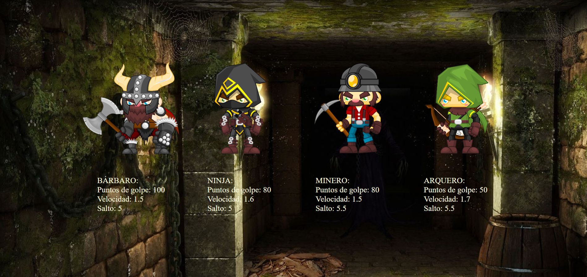
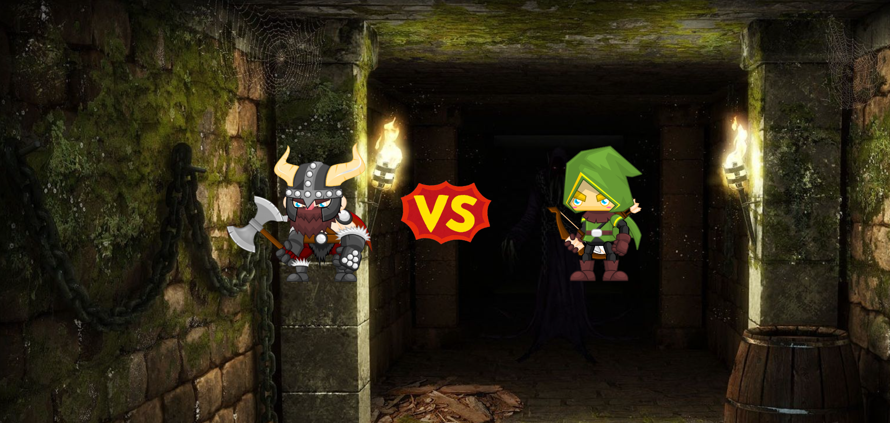
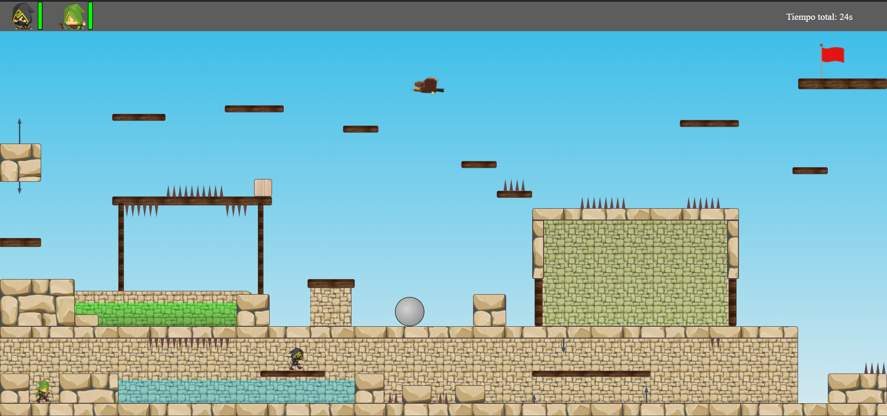

#### PROYECTO 3: JUEGO

#### Definición y alcance:

El objeto de este proyecto con fines de formación, el tercero de los que desarrollamos durante el bootcamp "Full Stack Developer" en GeeksHubs, es la realización de un minijuego para ejecutar en el navegador, que debe tener las siguientes características:  
 
- Minimo de 5 vistas incluyendo los menús, diseñado como una single page application, incluyendo presentación, vista de selección, preparación, juego y ganador.  
- Posibilidad de elección entre no menos de 4 opciones distintas y dos jugadores a la vez.  
- El desarrollo del juego en sí es de diseño libre, pero debe haber al menos una simulación con resultados aleatorios o algún modo de que los resultados vayan variando en función de la interacción con el usuario.  

#### Objetivos:

1- Single page application.  
2- Orientado a objetos.  
3- Manipulación del DOM.  

Todo ello empleando únicamente, con fin de entrenamiento, HTML, CSS y JavaScript Vanilla.  

#### Memoria:

Tras considerar las opciones, se ha optado por desarrollar un pequeño sistema de físicas capaz de simular la jugabilidad de un juego clásico de plataformas para crear un mimimapa con distintos tipos de obstáculos (implementados en otras tantas clases) hasta poder llegar a la meta. el desarrollo abarcó unos 12 días de trabajo de forma intermitente, mientras se avanzaba en otras materias de la formación antes mencionada. Por simplicidad matemática, todos los objetos son ortogonales. La disponibilidad de tiempo ha sido el factor que ha determinado el acabado final y las funcionalidades disponibles.

#### Funcionamiento:

La primera vista es una simple presentación que podemos pasar haciendo click en cualquier punto de la pantalla. Después de eso, se accede a la vista de selección de personajes:

De aquí se elegirá primero el personaje para el primer jugador y acontinuación el del segundo jugador. No es posible utilizar el mismo personaje. Todos tienen características levemente diferentes, donde las velocidades vienen ecpresadas en px recorridos por unidad de tiempo de muestreo (en este caso 10ms, con lo que multiplicando por 100 tendríamos la velocidad en px/s). Los personajes están sometidos a una aceleración de 10px/s^2. Una vez hay dos personajes escogidos, se pasa a la vista 3 de espera durante unos instantes.

Los personajes se manejan con el teclado. Los controles para los dos jugadores son los siguientes:  
JUGADOR 1:   
Mover a la izquierda: a  
Mover a la derecha: d  
Salto: w  

JUGADOR 2:   
Mover a la izquierda: tecla dirección izquierda  
Mover a la derecha: tecla dirección derecha  
Salto: tecla dirección arriba  

La condición de victoria es alcanzar la plataforma con la bandera roja, en la esquina superior derecha de la pantalla.

Versión actual del juego: https://antonioml-sc.github.io/GameForGeeksHubs/

#### Bugs conocidos y posibles nuevos trabajos:

- El código siempre se puede optimizar un tanto más. Seguro que hay algún modo más sencillo de hacer lo mismo.  
- El apartado gráfico y artístico es muy mejorable, comenzando por un transfondo más concreto, animaciones para los personajes, música...  
- Aunque las herramientas que se han empleado para su realización no son las óptimas, se pueden incluir muchas cosas más a nivel de mecánicas de juego, sólo limitado por la imaginación.

#### Créditos y agradecimientos:

- Las imágenes y texturas usadas no son obra mía. Son de libre uso o usadas bajo licencia.  
- Mi más sentida gratitud a los docentes y compañeros de GeeksHubs por la formación y el ánimo para seguir mejorando.